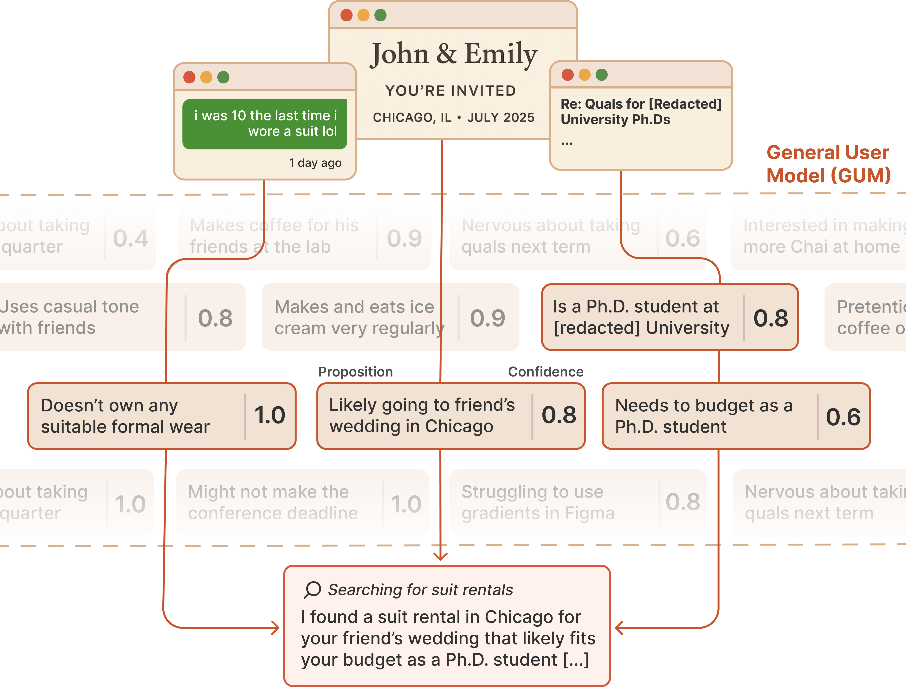

# General User Models

<div style="text-align: center;">

</div>

General User Models (GUMs) learn about you by observing _any_ interaction you have with your computer. The GUM takes as input any unstructured observation of a user (e.g., device screenshots) and constructs confidence-weighted propositions that capture the user's knowledge and preferences. GUMs introduce an architecture that infers new propositions about a user from multimodal observations, retrieves related propositions for context, and continuously revises existing propositions.

*tl;dr* Everything you do can be used to make your systems more context-aware.

## Getting Started

First, you'll need to install the GUM package. There are two ways to do it:

!!! info "Getting Started I: Installing the GUM package"

    === "pip"
        Great! Just pip install.

        ```bash
        > pip install -U gum-ai
        ```

    === "From source"

        ```bash
        > git clone git@github.com:GeneralUserModels/gum.git
        > cd gum
        > pip install --editable .
        ```    

You can start a GUM server directly from the command line. 

!!! info "Getting Started II: Starting a GUM server"

    We recommend running this in a tmux or screen session to keep it alive.

    === "Local LMs on a GPU server (recommended)"
        First, install [SGLang](https://sgl-project.github.io/start/install.html) and launch its server with your LM.

        ```bash
        > pip install "sglang[all]"
        > pip install flashinfer -i https://flashinfer.ai/whl/cu121/torch2.4/ 

        > # Launch model
        > CUDA_VISIBLE_DEVICES=0 python -m sglang.launch_server ....

        > # name of the model you launched
        > export MODEL_NAME="model-org/model-name"

        > # your full name
        > export USER_NAME="Full Name"

        > # point this to the GUM multimodal model
        > export GUM_LM_API_BASE="base-url"

        > # (optionally) set an API key
        > export GUM_LM_API_KEY="None"

        ```

        Alternatively, we recommend using [SkyPilot](https://docs.skypilot.co/en/latest/docs/index.html) to serve and run your own models on the cloud. You can use the following [skypilot.yaml](https://github.com/GeneralUserModels/gum/blob/main/skypilot-tmp.yaml) file in the repo. You'll need to replace the HuggingFace token (HF_TOKEN) with your own. By default, we use Qwen 2.5 VL 32B (AWQ quanitized). A single H100 (80GB) should give you good enough throughput.

    === "OpenAI"
        You can authenticate by setting the `OPENAI_API_KEY` and `USER_NAME` env variables.

        ```bash
        > export OPENAI_API_KEY="your-api-key-here"
        > export USER_NAME="Full Name"
        ```

    !!! note "Required Permissions"
        Go to “System Settings” → “Privacy & Security” → “Accessibility” → turn on the “Terminal” option. This is necessary for GUM to observe your interactions and build its model when launched via the Terminal.
        
        When you first run the GUM (below), your system may also prompt you to grant accessibility and screen recording permissions to the application. You may need to restart the process a few times as you grant these permissions.

    Start the GUM listening process up through the Terminal app:

    ```bash
    > gum
    ```

    Once you're all done, go ahead and try querying your GUM to view propositions and observations. You can query for recent propositions by just passing the -q flag through the CLI.

    ```bash
    > gum -q
    ```

    Output:
    ```
    Found 10 results:

    Proposition: Omar Shaikh is currently actively engaged in developing and refining a Python application utilizing asynchronous programming with Observer patterns.
    Reasoning: The transcription indicates that Omar is working with the file `gum.py`, which includes classes and methods for managing asynchronous tasks and observers, as seen in functions like `start_update_loop()` and `_update_loop()`. These methods suggest a focus on maintaining efficiency in processing updates from various observers, clearly indicative of software development practices related to asynchronous programming.
    Confidence: 9.00
    Relevance Score: 0.50
    --------------------------------------------------------------------------------

    Proposition: Omar Shaikh deprioritizes longer or complex interactions with unnecessary dependencies, focusing on streamlined application performance instead.
    Reasoning: From the transcript, he is primarily concerned with efficient resource management in `gum.py`, such as ensuring active tasks are being handled correctly, which is shown through his attentiveness to cleaning up resources in `async def __aexit__`. This behavior implies he prioritizes simplicity and efficiency over possible more complicated implementations.
    Confidence: 8.00
    Relevance Score: 0.50
    --------------------------------------------------------------------------------

    Proposition: Omar Shaikh demonstrates a clear preference for using Google AI Studio for coding support and suggestions.
    Reasoning: Evidence from the transcript highlights that Omar interacts with Google AI Studio to receive suggestions for Python code modifications, specifically aimed at improving the codebase he is working on. This indicates a strong reliance on Google AI Studio resources, reinforcing his inclination towards engaging AI-assisted coding tools in his work.
    Confidence: 8.00
    Relevance Score: 0.50

    [...]
    ```

    Optionally, you can pass a query string and the number of results you want back (by default, 10). In the example below, I want to find things that are related to work on GUMs. 

    ```bash
    > gum -q "gum" -l 10
    ```

    Output:
    ```
    Found 10 results:

    Proposition: Omar Shaikh is executing coding projects, specifically troubleshooting errors in his Python scripts, such as resolving 'TypeError: 'InstrumentedSet' object is not subscriptable' related to the GUM application.
    Reasoning: The terminal logs reflecting the traceback error during execution of the `gum` script reveal that Omar is engaged in debugging activities within his coding project.
    Confidence: 9.00
    Relevance Score: 0.39
    --------------------------------------------------------------------------------

    Proposition: Omar Shaikh is actively developing a Python-based application called 'gum'.
    Reasoning: The terminal output shows that Omar is working within a project directory that includes `gum.py`, `models.py`, and other related files. This indicates a focused effort on a specific software project, likely centered on artificial intelligence given the context of named modules and functionality updates.
    Confidence: 9.00
    Relevance Score: 0.11

    [...]
    ```

## Applications

Once you're all set up, check out the tutorials [here.](tutorials/mcp.md) There are a host of cool applications you can build atop of GUMs.

!!! info "Getting Started III: Querying GUMs with the API"

    One of the main methods you'll use to interface with the GUM is the query function. It's exactly what the CLI calls under the hood. Simply pass your query in as a parameter (uses BM25 under the hood). The query takes many more arguments, which you can read about [here.](api-reference/core.md#gum.gum.gum.query)

    ```python linenums="1"
    import asyncio
    from gum import gum

    gum_instance = gum("Your Name", model="gpt-4.1")

    async def main():
        await gum_instance.connect_db()
        print(await gum_instance.query("email"))

    if __name__ == "__main__":
        asyncio.run(main())
    ```

For example: you can set up [an MCP that uses GUMs here.](tutorials/mcp.md)

## Under the hood

<div style="text-align: center;">

</div>

### **Observers** collect raw interaction data.
Observers are modular components that capture various user interactions: screen content, notifications, etc. Each observer operates independently, streaming its observations to the GUM core for processing. We implement a [Screen observer](api-reference/observers.md) as an example.

### **Propositions** describe inferences made about the user.
The core of GUM is its proposition system, which transforms raw observations into structured knowledge. Each proposition carries a confidence score and connects to related information, continuously updating as new evidence arrives.
