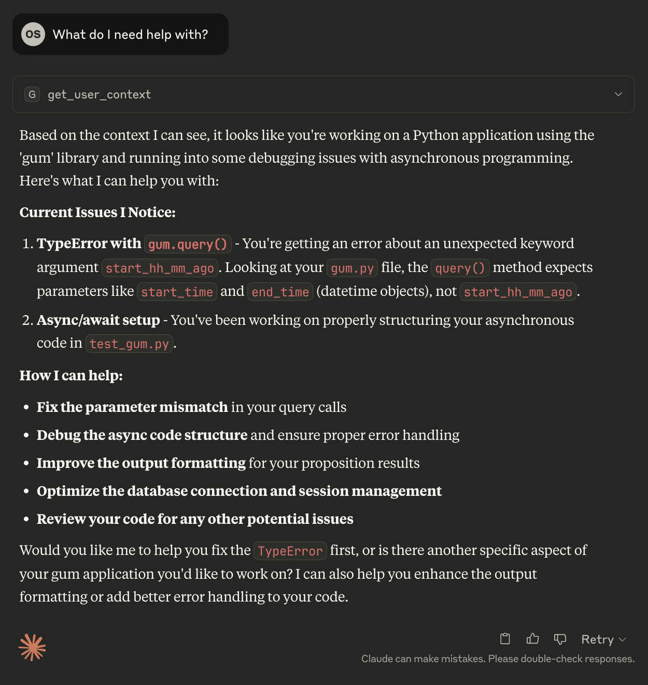

# Using MCPs to connect to GUMs

## I just want to set up the MCP

First, you'll need to set up the GUM in general and have it build some sense of your context. To do this, follow the instructions on [the front page here](../index.md). You'll also need a client that supports MCP. One example client is the MacOS Claude Desktop app, which you can download [here](https://claude.ai/download). The Claude desktop app requires the uv package manager for MCP, so you'll need to follow [the instructions on the uv website](https://docs.astral.sh/uv/getting-started/installation/) (or simply ```brew install uv```).

!!! note "If you didn't use brew, make sure uv is installed _globally_"
    Annoyingly, some apps (Claude) don't look at your local PATH. So if you didn't use brew, your uv might be in your local bin ```~/.local/bin/uv```. You can test this by running ```which uv```. Luckily, you can just set a symlink to fix this:

    ```
    sudo ln -s ~/.local/bin/uv /usr/local/bin/uv
    ```

### Option 1: One-click Desktop Extention (DXT).

DXTs are [extention files](https://github.com/anthropics/dxt) that make the MCP setup really easy. First, make sure the Claude desktop app is updated! Download the .dxt file from [the releases page here](https://github.com/GeneralUserModels/gumcp/releases) and just double-click (or drag it into the extentions page in the Claude Desktop app; Claude > Settings > Extentions). You'll be asked to provide your full name so the GUM knows who you are. Don't forget to enable the extention, and you'll be good to go!

### Option 2: Manual Setup

Clone the [MCP Repository](https://github.com/GeneralUserModels/gumcp) and run the following:

```bash
> git clone git@github.com:GeneralUserModels/gumcp.git
> cd gumcp
```

In the gumcp folder, create a .env file with your environment variables. All you need is a user name in the file (e.g.```USER_NAME="Omar Shaikh"```). In sum, the contents of your .env file look something like this:

```bash
USER_NAME="Omar Shaikh"
```

Finally, install the MCP client, pointing to the .env file:

```bash
> uv run mcp install server.py -f .env --with gum-ai
```

The MCP should then be enabled in the Claude app!

!!! note "The MCP **only** connects clients like the Claude app to the GUM."
    Simply enabling the MCP does not mean the GUM is learning. You still need to have the background GUM process running to build the underlying database of propositions (e.g. from the instructions on [the front page here.](../index.md))

## Try it out!

Here's an example of what happens when I prompt Claude and it uses the MCP:

<div style="text-align: center;">

</div>

## Tutorial

(coming soon: a walkthrough on how this was built!)